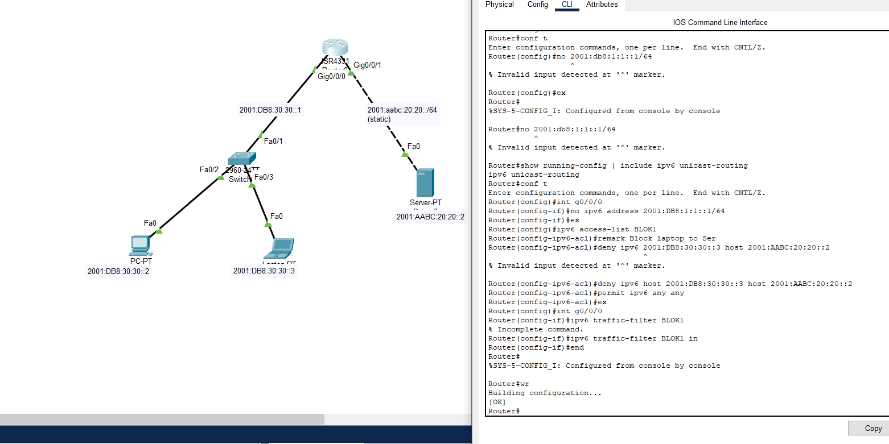

# 🌐 IPv6 Access Control List (ACL) Configuration

<div align="center">


**IPv6 network security implementation with Access Control Lists**

</div>

---

## 📋 Overview

Proyek ini mendemonstrasikan implementasi IPv6 Access Control List (ACL) pada router Cisco untuk mengontrol traffic jaringan. Menggunakan IPv6 unicast routing dan traffic filtering untuk meningkatkan keamanan jaringan.

---

## 🖼️ Network Topology

<div align="center">
  
  <p><em>Network topology dengan IPv6 addressing dan ACL implementation</em></p>
</div>

---

## 💻 CLI Configuration

<div align="center">
  
  <p><em>IPv6 ACL configuration via command-line interface</em></p>
</div>

---

## 🔧 Network Components

### Devices
- **SR431 Router** - Main router dengan IPv6 routing
- **2960-24TT Switch** - Layer 2 switching
- **PC-PT & Laptop-PT** - End devices
- **Server-PT** - Network server

### IPv6 Addressing Scheme
```
Router Interface (Gig0/0/0): 2001:DB8:1:1::1/64
PC-PT:                       2001:DB8:30:30::2/64
Laptop-PT:                   2001:DB8:30:30::3/64
Server-PT:                   2001:AABC:20:20::2/64
ISP Router (Fa0):            2001:AABC:20:20::/64 (static route)
ISP Router (Gig0/0/1):       2001:DB8:20:30::1/64
```

---

## 🛡️ IPv6 ACL Configuration

### ACL Purpose
Membatasi akses laptop (2001:DB8:30:30::3) ke server (2001:AABC:20:20::2) menggunakan IPv6 named access list.

### Configuration Commands

```cisco
Router> enable
Router# configure terminal
Router(config)# ipv6 unicast-routing

# Enable IPv6 on interface
Router(config)# interface g0/0/0
Router(config-if)# ipv6 address 2001:DB8:1:1::1/64
Router(config-if)# no shutdown
Router(config-if)# exit

# Create IPv6 ACL
Router(config)# ipv6 access-list BLOK1

# Remark for documentation
Router(config-ipv6-acl)# remark Block laptop to Server

# Deny specific host
Router(config-ipv6-acl)# deny ipv6 host 2001:DB8:30:30::3 host 2001:AABC:20:20::2

# Permit all other traffic
Router(config-ipv6-acl)# permit ipv6 any any

Router(config-ipv6-acl)# exit

# Apply ACL to interface
Router(config)# interface g0/0/0
Router(config-if)# ipv6 traffic-filter BLOK1 in
Router(config-if)# end

# Save configuration
Router# write memory
```

---

## 📖 Key Concepts

### IPv6 ACL Types
- **Named ACL**: Menggunakan nama deskriptif (contoh: BLOK1)
- **Standard vs Extended**: IPv6 hanya menggunakan extended ACL
- **Direction**: `in` (inbound) atau `out` (outbound)

### ACL Logic
1. **Deny Statement**: Blok traffic dari laptop ke server
2. **Permit Statement**: Izinkan semua traffic lainnya
3. **Implicit Deny**: Traffic yang tidak match akan di-deny (built-in)

---

## 🧪 Testing & Verification

### Verify IPv6 Configuration
```cisco
Router# show ipv6 interface brief
Router# show running-config | include ipv6 unicast-routing
```

### Verify ACL
```cisco
# Show ACL configuration
Router# show ipv6 access-list BLOK1

# Show interface ACL binding
Router# show ipv6 interface g0/0/0
```

### Connectivity Tests

**From PC (Should Work):**
```
PC> ping 2001:AABC:20:20::2
Reply from 2001:AABC:20:20::2: bytes=32 time<1ms TTL=126
```

**From Laptop (Should Fail):**
```
Laptop> ping 2001:AABC:20:20::2
Request timed out.
```

---

## 📊 Project Specifications

| Parameter | Value |
|-----------|-------|
| Protocol | IPv6 |
| ACL Type | Named IPv6 ACL |
| ACL Name | BLOK1 |
| Direction | Inbound (in) |
| Routing | IPv6 Unicast Routing |
| Security Policy | Host-specific blocking |

---

## 🎯 Learning Objectives

- ✅ IPv6 addressing and configuration
- ✅ IPv6 unicast routing setup
- ✅ Named IPv6 ACL creation
- ✅ Traffic filtering implementation
- ✅ Security policy enforcement
- ✅ ACL troubleshooting and verification

---

## 📁 Project Files

```
.
├── assets/
│   ├── cisco.pkt          # Packet Tracer file with IPv6 ACL config
│   └── sipinidia.png      # Network topology diagram
└── README.md
```

---

## 🔍 Troubleshooting

### Common Issues

**1. ACL Not Working**
```cisco
# Check if ACL is applied to interface
Router# show ipv6 interface g0/0/0 | include access list

# Verify ACL entries
Router# show ipv6 access-list BLOK1
```

**2. IPv6 Routing Issues**
```cisco
# Enable IPv6 routing if not active
Router(config)# ipv6 unicast-routing

# Check routing table
Router# show ipv6 route
```

**3. Wrong Direction**
```cisco
# Remove incorrect ACL
Router(config-if)# no ipv6 traffic-filter BLOK1 out

# Apply in correct direction
Router(config-if)# ipv6 traffic-filter BLOK1 in
```

---

## 💡 Best Practices

- 📝 Always add `remark` untuk dokumentasi ACL
- ✅ Test ACL sebelum apply ke production
- 🔄 Gunakan `permit ipv6 any any` di akhir untuk explicit permit
- 💾 Simpan konfigurasi dengan `write memory` atau `copy run start`
- 🎯 Apply ACL sedekat mungkin dengan source traffic

---

## 🤝 Contributing

Suggestions untuk improvement:
1. Fork the project
2. Create feature branch
3. Commit changes
4. Push to branch
5. Open pull request

---

## 👨‍💻 Author

**renaiy0**

---

<div align="center">

**Securing Networks with IPv6 ACL**

*One packet filter at a time*

</div>
